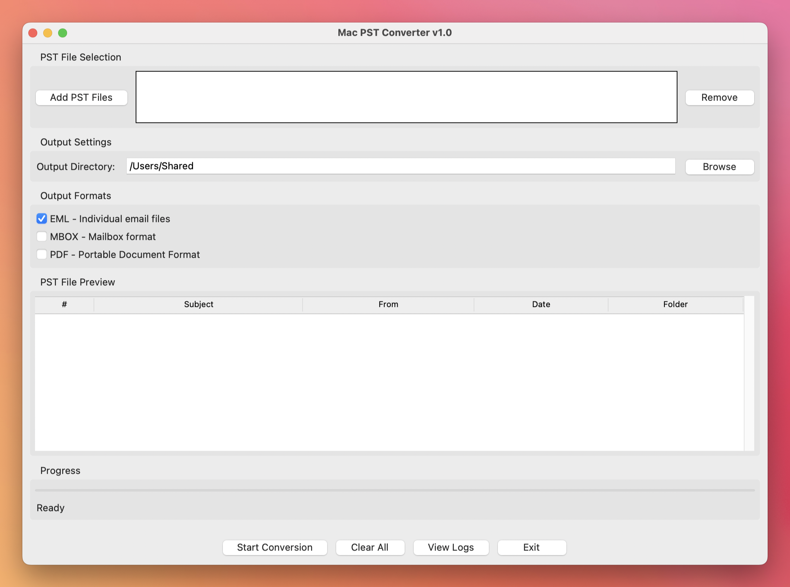

# Mac PST Converter

A Python application for converting Microsoft Outlook PST files to various formats on macOS. This tool enables users to extract and convert PST data without requiring Microsoft Outlook installation.



## Features

- **Multiple Output Formats**: Convert PST files to EML, MBOX, PDF, and more
- **Batch Processing**: Process multiple PST files simultaneously
- **GUI Interface**: User-friendly graphical interface built with Tkinter
- **Message Filtering**: Filter messages by date range, sender, subject, and attachments
- **Duplicate Detection**: Identify and remove duplicate emails
- **Folder Structure Preservation**: Maintain original PST folder hierarchy
- **Progress Tracking**: Real-time progress updates during conversion
- **Cross-Platform**: Works on macOS with Python 3.8+

## System Requirements

- **Operating System**: macOS 10.8 (Mountain Lion) and above
- **Python**: 3.8 or later
- **RAM**: Minimum 4 GB
- **Storage**: 512 MB free space

## Installation

### Option 1: Quick Install (Recommended)

```bash
# Clone the repository
git clone https://github.com/yourusername/macpst-converter.git
cd macpst-converter

# Run the installation script (macOS with Homebrew)
./install_deps.sh

# Or install manually:
pip install -r requirements.txt
```

### Option 2: Minimal Installation

```bash
# Clone the repository
git clone https://github.com/yourusername/macpst-converter.git
cd macpst-converter

# Install core dependencies only
pip install -r requirements-minimal.txt

# Note: This provides basic functionality with limited PST parsing
```

### Option 3: Full Installation with Enhanced PST Support

```bash
# Install all dependencies including full PST parsing
pip install -r requirements.txt

# This now includes libpff-python for complete PST support
# Alternative if pip fails:
conda install -c conda-forge libpff-python
```

## Usage

### GUI Application

Launch the graphical interface:

```bash
# If installed via pip
macpst-converter

# Or run directly
python -m src.macpst.main
```

### Using the GUI:

1. **Add PST Files**: Click "Add PST Files" to select one or more PST files
2. **Choose Output Directory**: Select where converted files should be saved
3. **Select Output Formats**: Choose from EML, MBOX, PDF formats
4. **Preview**: Double-click a PST file to preview its contents
5. **Start Conversion**: Click "Start Conversion" to begin the process

### Command Line Usage

```python
from src.macpst.core.pst_parser import PSTParser
from src.macpst.core.converter import Converter

# Parse PST file
with PSTParser("path/to/file.pst") as parser:
    messages = list(parser.extract_messages())

# Convert to EML format
converter = Converter("output/directory")
result = converter.convert_messages(messages, "eml")
print(f"Converted {result['converted_count']} messages")
```

## Supported Output Formats

| Format | Extension | Description |
|--------|-----------|-------------|
| EML | .eml | Individual email files |
| MBOX | .mbox | Mailbox format (single file) |
| PDF | .pdf | Portable Document Format |

*Note: Additional formats (MSG, HTML, CSV, VCF, ICS) will be added in future versions.*

## Configuration

### Message Filtering

```python
from src.macpst.utils.filters import MessageFilter
from datetime import datetime

# Create filter
filter = MessageFilter()
filter.set_date_range(
    date_from=datetime(2023, 1, 1),
    date_to=datetime(2023, 12, 31)
)
filter.add_sender_filter("important@company.com")
filter.set_attachment_filter(has_attachments=True)

# Apply filter
filtered_messages = filter.filter_messages(messages)
```

### Duplicate Detection

```python
from src.macpst.utils.filters import DuplicateDetector

# Configure duplicate detection
detector = DuplicateDetector()
detector.configure(
    check_subject=True,
    check_sender=True,
    check_recipients=True,
    check_body=False
)

# Remove duplicates
unique_messages = detector.remove_duplicates(messages, keep_strategy='newest')
```

### Batch Processing

```python
from src.macpst.core.batch_processor import BatchProcessor

# Create batch processor
processor = BatchProcessor("output/directory", max_workers=4)

# Configure filtering and duplicate removal
processor.configure_filter(message_filter)
processor.configure_duplicate_detection(detector, remove_duplicates=True)

# Process multiple PST files
pst_files = ["file1.pst", "file2.pst", "file3.pst"]
results = processor.process_files(pst_files, ["eml", "pdf"])
```

## Development

### Project Structure

```
macpst/
├── src/
│   └── macpst/
│       ├── core/          # Core parsing and conversion logic
│       ├── gui/           # GUI components
│       ├── converters/    # Format-specific converters
│       └── utils/         # Utility functions
├── tests/                 # Unit and integration tests
├── requirements.txt       # Python dependencies
└── setup.py              # Package configuration
```

### Running Tests

```bash
# Run all tests
python -m pytest tests/

# Run specific test module
python -m pytest tests/unit/test_pst_parser.py

# Run with coverage
python -m pytest tests/ --cov=src/macpst
```

### Dependencies

**Core Dependencies:**
- `pypff`: PST file parsing (recommended)
- `libpst-python`: Alternative PST parser
- `reportlab`: PDF generation
- `python-dateutil`: Date parsing and manipulation
- `cryptography`: Encryption support

**GUI Dependencies:**
- `tkinter`: GUI framework (included with Python)

## Troubleshooting

### Common Issues

**PST File Not Recognized:**
- Ensure the file has a valid PST signature
- Check that the file is not corrupted
- Verify the PST file version is supported (Outlook 97-2021, Office 365)

**Import Error for libpff-python:**
- Install using: `pip install libpff-python`
- If installation fails, the app will use basic parsing (limited functionality)
- Alternative: Try `conda install -c conda-forge libpff-python`

**Memory Issues with Large PST Files:**
- Process files in smaller batches
- Increase available system memory
- Use message filtering to reduce dataset size

**GUI Not Launching:**
- Ensure tkinter is installed: `python -m tkinter`
- Check Python version compatibility (3.8+)

### Logging

The application logs activities to `~/macpst_converter.log`. Check this file for detailed error information.

## Contributing

1. Fork the repository
2. Create a feature branch (`git checkout -b feature/new-feature`)
3. Make changes and add tests
4. Run the test suite (`python -m pytest`)
5. Commit changes (`git commit -am 'Add new feature'`)
6. Push to the branch (`git push origin feature/new-feature`)
7. Create a Pull Request

## License

This project is licensed under the MIT License - see the LICENSE file for details.

## Acknowledgments

- Microsoft for the PST file format specification
- The libpst project for PST parsing libraries
- The Python community for excellent libraries

## Support

- **Issues**: Report bugs at [GitHub Issues](https://github.com/yourusername/macpst-converter/issues)
- **Contact**: Create an issue for questions and support

---

**Note**: This tool is not affiliated with Microsoft Corporation. PST is a proprietary format owned by Microsoft.